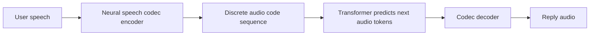

# Hindi conversational speech model (fine-tune, not scratch)

## What you are building

You described **speech-to-speech**, ChatGPT-style interaction, and **next voice-token prediction**. In open systems that usually means:

The **language** is learned mostly in how the LM maps **incoming speech token context** to **outgoing speech token sequences**, often with a **text tokenizer** for partial supervision or turn structure. You do **not** need to train the codec from scratch; you **fine-tune the LM** (and optionally swap/extend text tokenization for Hindi).

**Important constraint:** State-of-the-art open checkpoints are **English-heavy**. Hindi quality comes from **enough Hindi conversational audio** (real or carefully curated). A small fine-tune improves Hindi prosody/intelligibility; very small data may only add a “Hindi accent” on English unless you add more hours.

---

## Recommended backbone (pick one primary track)

| Track                                                    | Fit for your goal                                                                                                                      | Fine-tuning story                                                                                                                                                                                                                 |
| -------------------------------------------------------- | -------------------------------------------------------------------------------------------------------------------------------------- | --------------------------------------------------------------------------------------------------------------------------------------------------------------------------------------------------------------------------------- |
| **[Kyutai Moshi](https://github.com/kyutai-labs/moshi)** | Built for **spoken dialogue** and **full-duplex** behavior; matches “talk to it” closely.                                              | Official/community fine-tuning: `[kyutai-labs/moshi-finetune](https://github.com/kyutai-labs/moshi-finetune)` (and related discussions in the Moshi repo). **Mimi codec** is typically **frozen**; you adapt the **transformer**. |
| **[Sesame CSM](https://github.com/sesameailabs/csm)**    | **Conversational** speech generation with **Mimi-style** audio codes + LLM backbone; integrated in recent **Transformers** model docs. | Community examples show **decoder / audio-head–focused** fine-tunes to preserve conversational priors (see HF ecosystem around `csm`). Good if you prefer the Hugging Face training stack.                                        |

**Practical recommendation:** Start with **Moshi + `moshi-finetune`** if your priority is **true speech-in → speech-out** interaction and you can follow Kyutai’s stack. Consider **CSM** if you want a **Transformers-centric** workflow and are comfortable mapping their data format.

There is public precedent for **Hindi on the Moshi family** (e.g. **Human-1** on Hugging Face): Hindi **SentencePiece** text tokenizer, re-init of **vocabulary-tied layers**, large Hindi dialogue corpus. You would **not** replicate 26k GPU-hours at home; the **same ideas** apply at **smaller scale** (few to tens of hours of clean Hindi dialogue, staged training).

---

## Phase A — General Hindi first (your choice)

**Objective:** Model responds in **clear Hindi speech** in a turn-taking setup, without optimizing for one identity yet.

1. **Lock the stack**
  - Install inference for your chosen base (Moshi or CSM) and confirm **English baseline** works on your GPU.
2. **Hindi text tokenizer (if the model uses text side)**
  - Train or reuse a **Hindi SentencePiece** (or compatible) model on Hindi text.  
  - Map **vocabulary-dependent layers** per the checkpoint’s README / community Hindi recipes (embedding / text projection layers often **re-initialized** while **audio + most transformer weights** stay pretrained).
3. **Audio data (the main lever)**
  - Prefer **real Hindi conversations**: interviews, call-center style dialogues, drama/podcast multi-speaker, or any **two-sided** speech with clean audio.  
  - Target **at least several hours** of **curated** dialogue for a noticeable shift; **tens of hours** if you want robust general Hindi.  
  - Preprocess to the training repo’s expected format (turn boundaries, sample rate, channel layout, VAD or segmentation as required).
4. **Fine-tuning strategy (not from scratch)**
  - **Freeze** the **neural codec (Mimi / equivalent)** initially.  
  - **Train the speech LM** with a conservative recipe: lower LR on pretrained blocks, optional **short warmup**, **gradient checkpointing** if VRAM-limited.  
  - Optionally **stage 2**: unfreeze **narrow subsets** (e.g. specific blocks) only if you have enough data and observe underfitting.
5. **Evaluation**
  - **MOS / subjective** listening for Hindi naturalness.  
  - **WER** via a strong Hindi ASR on **generated** audio (cheap regression test as you iterate).  
  - Simple **turn-taking** tests: interruptions, silence, backchannel (if using a full-duplex stack).

---

## Phase B — Speaker-specific behavior (later)

**Objective:** Bias toward **one voice** or **consistent persona**.

- Use **more audio from one speaker** (or explicit speaker IDs if the architecture supports conditioning).  
- Prefer **adapter / LoRA-style** additions if the fine-tune repo supports them, to avoid catastrophic forgetting of conversational ability.  
- If the base model has **no native speaker embedding**, cloning quality is limited; you may combine with a **separate TTS/cloning head** later (only if you accept a two-module system).

---

## Hardware and ops (order-of-magnitude)

- **Minimum viable:** Single **24 GB** GPU for small experiments (batch size 1, heavy checkpointing).  
- **Comfortable:** **40–80 GB** or **multi-GPU** for faster iteration and larger context.  
- Storage: **raw audio + extracted tokens** can grow quickly; plan **hundreds of GB** if you scale data.

---

## Repo layout (greenfield)

Your workspace is empty today. A sensible layout after you start coding:

- `data/` — raw Hindi audio, manifests, train/val splits  
- `configs/` — training YAMLs (LR, freeze rules, paths)  
- `scripts/` — preprocessing, tokenizer training, evaluation  
- `third_party/` or git submodules — `moshi`, `moshi-finetune`, or CSM clone

---

## Risks and mitigations

- **Insufficient Hindi dialogue data** → weak Hindi, or **code-switching** to English. Mitigate with more **native multi-turn** audio and data cleaning.  
- **Codec frozen** → rare phonemes may reconstruct poorly. Mitigate with **more diverse Hindi speakers** in training; codec fine-tuning is usually **out of scope** for first project.  
- **Evaluation without ASR** → you optimize by ear only. Add **Hindi ASR scoring** for iteration speed.

---

## Summary

You should **fine-tune a pretrained conversational audio-token LM** (Moshi or CSM) with **Hindi conversational audio**, **freeze the codec**, and **adapt text tokenization + vocabulary-tied layers** where applicable. Phase A optimizes **general Hindi**; Phase B adds **speaker focus** with targeted data and light adapters. This matches **fine-tuning, not training from scratch**, while aligning with **next voice-token** and **speech-to-speech** interaction.